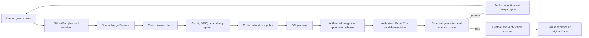

# Lifecycle dependency map

Solid local bootstrap nodes are verified; external transitions remain gated and are not represented as completed deployment evidence.

Implemented bootstrap: V/S/G/P checks, habitat/APIs/lineage, candidate/release/report helpers and injected rollback orchestration. Bootstrap standard-runner GitHub CI verifies OCI without publishing it. GitLab-native artifacts, Duo execution, R/C/real H/L/A/F depend on canonical identity/resources and the owner's explicit production authority. See REMAINING_WORK.md.
